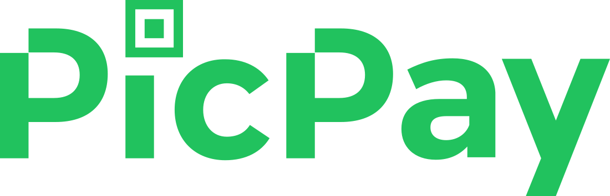

  
  
  
  <h1>UI Clone - PicPay</h1>
  
  
PicPay UI Clone (partial) for study purposes.

  
  

  
  

    
    
        
    
  
   
  
  

    
  

# About

The project itself was created in order to implement my knowledge learned using React Native and Typescript.

# Techs

 - [React Native com Expo](https://expo.io)
 - [Styled Components](https://styled-components.com/)
 - [TypeScript](https://www.typescriptlang.org/)

# Requirements

- [Git](https://git-scm.com/) installed
- [Node](https://node.js.org/) installed
- Npm or [Yarn](https://yarnpkg.com/) installed

# Usage

- Run `npm install` or `yarn install`.
- Run `yarn start` and access `http://localhost:3000`

# Authors

- [zevdvlpr](https://github.com/zevdvlpr)

 
 
 
 

  <h1>Open Source</h1>
  Copyright © 2020-present, zevdvlpr.
  
PicPay UI Clone <a href="https://github.com/zevdvlpr/discord-clone/tree/master/LICENSE">is MIT licensed 💖</a>

  

